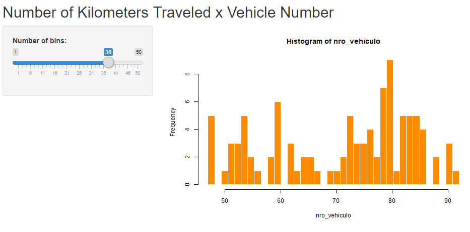

```{r setup, include=FALSE}
knitr::opts_chunk$set(echo = TRUE)
```

## 1. Shiny Presentation

This R Markdown presentation is made interactive using Shiny. The viewers of the presentation can change the assumptions underlying what's presented and see the results immediately. 

To learn more, see [Interactive Documents](http://rmarkdown.rstudio.com/authoring_shiny.html).

## 2. Assignment

OK, you've made your shiny app, now it's time to make your pitch. You get 5 slides (inclusive of the title slide) to pitch a your app. You're going to create a web page using Slidify or Rstudio Presenter with an html5 slide deck.

Here's what you need

* 5 slides to pitch our idea done in Slidify or Rstudio Presenter
* Your presentation pushed to github or Rpubs
* A link to your github or Rpubs presentation pasted into the provided text box


## 3. Project Objective

Your presentation must satisfy the following

* It must be done in Slidify or Rstudio Presenter
* It must be 5 pages
* It must be hosted on github or Rpubs
* It must contained some embedded R code that gets run when slidifying the document

NOTE: Slidify is no longer compatible with with Rpubs. If you choose to use Slidify you must share your presentation using GitHub Pages.


## 4. Configuration
the following necessary packages must be installed for the Shiny () library to work:

    ##install.packages("ggplot2")
    ##install.packages("graphics")
    ##install.packages("plotly")
    ##install.packages("shiny")
    ##install.packages("shinythemes")
    ##install.packages("dplyr")
    
Once the packages are installed, the following libraries must be run:

    library(ggplot2), library(graphics)
    library(plotly), library(shiny)
    library(shinythemes), library(dplyr)


## 5. Load and display the data

Load and display the data

    vehi1 <- read.csv("C:/Users/FGO/Desktop/Especializacion Data Science/9.Developing Data Products/TRABAJO4/vehi1.csv", sep=";")
    head(vehi1)

```{r vehi}
vehi1 <- read.csv("C:/Users/FGO/Desktop/Especializacion Data Science/9.Developing Data Products/TRABAJO4/vehi1.csv", sep=";")
```

```{r head}
    head(vehi1)
```

## 6. Iteractive application in RStudio using the shiny () function 



## 7. Code R Server.R 

    library(shiny)
    shinyServer(function(input, output) {
    
    output$distPlot <- renderPlot({
        
        # generate bins based on input$bins from ui.R
        nro_vehiculo    <- vehi1[, 3]
        bins <- seq(min(nro_vehiculo), max(nro_vehiculo), length.out = input$bins + 1)
        
        # draw the histogram with the specified number of bins
        hist(nro_vehiculo, breaks = bins, border="white", col="darkorange")
        
    })
    
    })

## 8. Code R ui.R 

    shinyUI(fluidPage(
    titlePanel("Number of Kilometers Traveled x Vehicle Number"),
    sidebarLayout(
        sidebarPanel(
            sliderInput("bins",
                        "Number of bins:",
                        min = 1,
                        max = 50,
                        value = 30)
        ),
        mainPanel(
            plotOutput("distPlot")
        )
    )
    ))